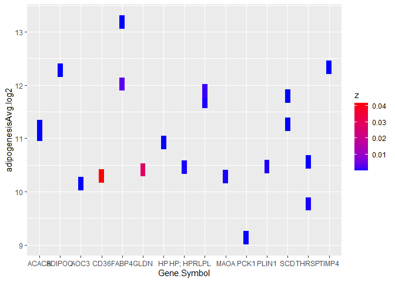

hmk_04
================

## loading of the tidyverse library

``` r
library(tidyverse)
```

## step1: reading of data file hmk directory

## step 2: representation of pvalue in the form of tiles using geom_tile. the x axis represents the gene symbol and its corresponding p value plotted when the cells are differentited into adipocytes

``` r
experiment <- read_csv(file = "C:/Users/ngogia/Documents/classes_2022/micr_575/hmk/my_data.csv")
```

    Rows: 20 Columns: 8
    ── Column specification ────────────────────────────────────────────────────────
    Delimiter: ","
    chr (3): ID, Gene.Symbol, Description
    dbl (5): adipogenesisAvg.log2, controlAvg.log2, Fold.Change, P.val, FDR P.val

    ℹ Use `spec()` to retrieve the full column specification for this data.
    ℹ Specify the column types or set `show_col_types = FALSE` to quiet this message.

``` r
glimpse(experiment)
```

    Rows: 20
    Columns: 8
    $ ID                   <chr> "207175_at", "203548_s_at", "203980_at", "235978_…
    $ adipogenesisAvg.log2 <dbl> 12.28, 11.69, 13.18, 12.02, 11.89, 10.56, 10.15, …
    $ controlAvg.log2      <dbl> 3.05, 2.71, 4.49, 3.35, 3.47, 2.95, 2.96, 4.76, 2…
    $ Fold.Change          <dbl> 600.18, 502.98, 412.70, 407.82, 342.93, 196.15, 1…
    $ P.val                <dbl> 5.81e-07, 4.00e-04, 7.73e-06, 2.90e-03, 1.10e-03,…
    $ `FDR P.val`          <dbl> 0.0079, 0.0715, 0.0235, 0.1386, 0.0972, 0.0358, 0…
    $ Gene.Symbol          <chr> "ADIPOQ", "LPL", "FABP4", "FABP4", "LPL", "THRSP"…
    $ Description          <chr> "adiponectin, C1Q and collagen domain containing"…

``` r
z <- experiment$P.val

plot1 <- ggplot(experiment) + 
  geom_tile(aes(x = Gene.Symbol, y = adipogenesisAvg.log2, fill = z)) +
  scale_fill_gradient(low="blue", high="red")

print(plot1)
```


## To test whether I could change the shape of the tiles in the data which is described above. I think its the best way to plot the data since we can see the pvalue clearly represented for each of the gene during adipogenesis with the highest expression represented in the red color and the lower one in blue. The expression patterns in between are the gradients of colors of intermediate expression during adipogenesis.

``` r
plot2 <- ggplot(experiment) + 
  geom_tile(aes(x = Gene.Symbol, y = adipogenesisAvg.log2, fill = z), 
            width = 0.25 , height = 0.25) + 
  scale_fill_gradient(low="blue", high="red")

print(plot2)
```



## Trying different representatiosn of the same data- Representation of the above data in form of a violin plot.

``` r
plot3 <- ggplot(experiment) + 
  geom_violin(aes(x = Gene.Symbol, y = adipogenesisAvg.log2 ),
                color = "green")

print(plot3)
```

    Warning: Groups with fewer than two data points have been dropped.
    Groups with fewer than two data points have been dropped.
    Groups with fewer than two data points have been dropped.
    Groups with fewer than two data points have been dropped.
    Groups with fewer than two data points have been dropped.
    Groups with fewer than two data points have been dropped.
    Groups with fewer than two data points have been dropped.
    Groups with fewer than two data points have been dropped.
    Groups with fewer than two data points have been dropped.
    Groups with fewer than two data points have been dropped.


## using the geom_histogram to represent the data in the form of a histogram. I think using an histogram to plot the data is not a very informative way to represent this data since it just plots the expression log of the adipogensis event but not necessarily any information about the genes or the pvalue.

``` r
plot4 <- ggplot(experiment) +
  geom_histogram(aes(y = adipogenesisAvg.log2), color = "purple")

print(plot4)
```

    `stat_bin()` using `bins = 30`. Pick better value with `binwidth`.


