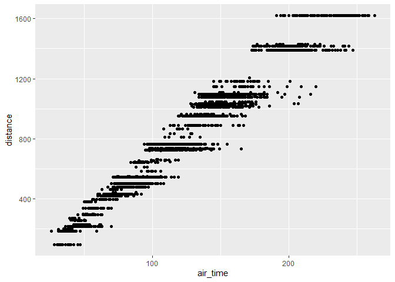
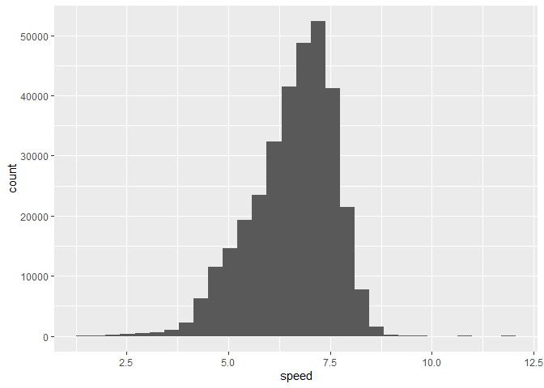

hmk_05
================

## installed the package `nycflights13`

``` r
library(tidyverse)
library(nycflights13)
```

## Question 1: filtering

``` r
nycflights13::airlines
```

    # A tibble: 16 × 2
       carrier name                       
       <chr>   <chr>                      
     1 9E      Endeavor Air Inc.          
     2 AA      American Airlines Inc.     
     3 AS      Alaska Airlines Inc.       
     4 B6      JetBlue Airways            
     5 DL      Delta Air Lines Inc.       
     6 EV      ExpressJet Airlines Inc.   
     7 F9      Frontier Airlines Inc.     
     8 FL      AirTran Airways Corporation
     9 HA      Hawaiian Airlines Inc.     
    10 MQ      Envoy Air                  
    11 OO      SkyWest Airlines Inc.      
    12 UA      United Air Lines Inc.      
    13 US      US Airways Inc.            
    14 VX      Virgin America             
    15 WN      Southwest Airlines Co.     
    16 YV      Mesa Airlines Inc.         

``` r
criteria1 <- filter(flights, origin=="LGA", day == 16, distance <= 2000)
```

``` r
ggplot(criteria1) +
  geom_point(aes(x = air_time, y = distance ))
```

    Warning: Removed 75 rows containing missing values (geom_point).



## Question 2: dealing with NAs

``` r
nycflights13::airlines
```

    # A tibble: 16 × 2
       carrier name                       
       <chr>   <chr>                      
     1 9E      Endeavor Air Inc.          
     2 AA      American Airlines Inc.     
     3 AS      Alaska Airlines Inc.       
     4 B6      JetBlue Airways            
     5 DL      Delta Air Lines Inc.       
     6 EV      ExpressJet Airlines Inc.   
     7 F9      Frontier Airlines Inc.     
     8 FL      AirTran Airways Corporation
     9 HA      Hawaiian Airlines Inc.     
    10 MQ      Envoy Air                  
    11 OO      SkyWest Airlines Inc.      
    12 UA      United Air Lines Inc.      
    13 US      US Airways Inc.            
    14 VX      Virgin America             
    15 WN      Southwest Airlines Co.     
    16 YV      Mesa Airlines Inc.         

``` r
criteria2 <- filter(flights, !(is.na (air_time)), origin=="LGA", day == 16, distance <= 2000)
```

``` r
ggplot(criteria2) +
  geom_point(aes(x = air_time, y = distance ))
```


## Question 3: adding columns

``` r
criteria3 <- mutate(flights, speed = distance/air_time)
```

``` r
ggplot(criteria3) + 
  geom_histogram(aes(x = speed))
```

    `stat_bin()` using `bins = 30`. Pick better value with `binwidth`.

    Warning: Removed 9430 rows containing non-finite values (stat_bin).


