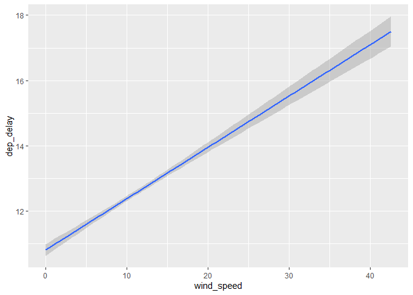

hmk_08
================

Q1: Summarizing operations and exploratory data analysis

Q1a

Download experiment1.csv from Canvas (under files). This reports two
variables from an experiment that has four treatments. Creatively, the
treatments are 1, 2, 3, and 4, and the two variables are x and y.

Create a data frame that contains the mean, standard deviation, and
number of points for each treatment. You will want to use functions like
summarise(), group_by(), mean(), and sd().

Are the data sets different in any important way?

``` r
library(tidyverse)
```

    ── Attaching packages ─────────────────────────────────────── tidyverse 1.3.2 ──
    ✔ ggplot2 3.3.6      ✔ purrr   0.3.4 
    ✔ tibble  3.1.8      ✔ dplyr   1.0.10
    ✔ tidyr   1.2.0      ✔ stringr 1.4.1 
    ✔ readr   2.1.2      ✔ forcats 0.5.2 
    ── Conflicts ────────────────────────────────────────── tidyverse_conflicts() ──
    ✖ dplyr::filter() masks stats::filter()
    ✖ dplyr::lag()    masks stats::lag()

``` r
data_tidy <- read_csv ("experiment1.csv")
```

    Rows: 44 Columns: 3
    ── Column specification ────────────────────────────────────────────────────────
    Delimiter: ","
    dbl (3): balls, x, y

    ℹ Use `spec()` to retrieve the full column specification for this data.
    ℹ Specify the column types or set `show_col_types = FALSE` to quiet this message.

``` r
tidying <- group_by(data_tidy, balls)
tidying_summary <- summarize (tidying, 
                              count = n(),
                              mean_x = mean(x),
                              mean_y = mean(y),
                              sd_x = sd(x),
                              sd_y = sd(y))
```

the values are pretty much similar and thus it wouldnt need to be graph
it.

Q2: pivoting

Create a plot that illustrates the differences in income among
religions, using the relig_income data set that is built into tidyverse.

You will need to create a tidy data frame to do this.

``` r
data_tidy1 <- read_csv("experiment2.csv")
```

    Rows: 1846 Columns: 3
    ── Column specification ────────────────────────────────────────────────────────
    Delimiter: ","
    chr (1): dataset
    dbl (2): x, y

    ℹ Use `spec()` to retrieve the full column specification for this data.
    ℹ Specify the column types or set `show_col_types = FALSE` to quiet this message.

``` r
tidying1 <- group_by(data_tidy1, dataset)
tidying_summary1 <- summarize (tidying1, 
                              count = n(),
                              mean_x = mean(x),
                              mean_y = mean(y),
                              sd_x = sd(x),
                              sd_y = sd(y))
```

``` r
relig_income <- relig_income
relig_long <- relig_income %>%
  pivot_longer(c ("<$10k", "$10-20k", "$20-30k", "$30-40k" , "$40-50k", "$50-75k", "$75-100k", "$100-150k", ">150k", "Don't know/refused"), 
               names_to = "income",
               values_to = "responses")

ggplot(relig_long) + 
  geom_point(aes(x = religion, y = responses, color = income)) + 
  theme(axis.text.x = element_text(angle = 90))
```


Q3: merging

Q3a: meaning of joins

join tells the database to combine columns from different tables

If you need unmatched rows in the primary table, use a left outer join.
If you don’t need unmatched rows, use an inner join.

Q3b: using joins

Using the flights and weather data sets from nycflights13, determine
whether there is a correlation between average hourly wind speed and
departure delays at NY airports.

This is a question about joins: you will need to join the flights and
weather by year, month, day, and hour. However, note that flights has
encoded departure time in a particularly annoying way: as an integers.
For instance, the integer 517 indicates 5:17 am.

weather gives average weather conditions each hour, with the hour given
as an integer (e.g., 5 indicating 5-6 am). You’re going to have to
figure out how to convert the time in flights into a form that matches
the form in weather.

If you want, you can use the lm() function to make a linear model of
departure delay as a function of wind speed. But it is also fine to just
make a plot of the two variables with geom_smooth().

``` r
library(nycflights13)
flights <- nycflights13::flights
weather <- nycflights13::weather
flights1 <- mutate(flights, 
                   dep_time_better =  round(dep_time, digits = -2)/100
                )
joined_fw <- left_join (x= flights1, y = weather, by = c("year" = "year", "month" = "month" , "day" = "day" , "dep_time_better" = "hour"))

ggplot(joined_fw)+
  geom_smooth(aes(x = wind_speed , y = dep_delay), 
              method = "lm")
```

    `geom_smooth()` using formula 'y ~ x'

    Warning: Removed 10523 rows containing non-finite values (stat_smooth).


